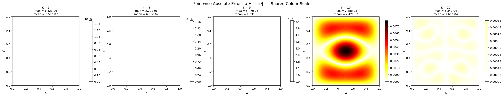
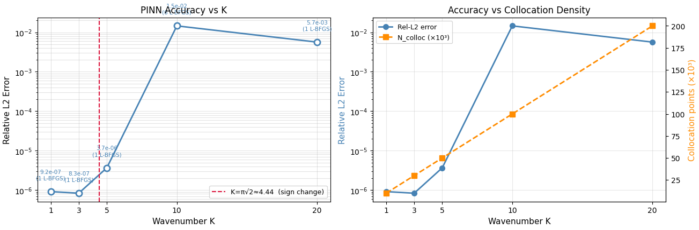

# SPINN Evaluation Task: Multi-Wavenumber PINN Study (2D Helmholtz)

**GSoC 2026 • ML4SCI • SPINN Project**
*Physics-Informed Neural Network Shape Optimization*

Systematic investigation of PINN failure modes across wavenumbers \(K = 1\) to \(20\), including diagnosis of multiple failure mechanisms and a new bug introduced during attempted fixes.

This work forms the foundation for **Phase 1** of my proposed GSoC project.

---

## Problem Statement

We solve the 2D Helmholtz equation with manufactured solution:

$$
\nabla^2 u + K^2 u = f(x,y), \quad (x,y) \in [0,1]^2, \quad u = 0 \text{ on } \partial\Omega
$$

where \( u^*(x,y) = \sin(\pi x)\sin(\pi y) \) and \( f = (K^2 - 2\pi^2)\sin(\pi x)\sin(\pi y) \), for \( K \in \{1, 3, 5, 10, 20\} \).

The exact solution is independent of \(K\); only the optimization difficulty changes making this an ideal controlled study of wavenumber effects on PINN training.

---

## Architecture (Common to All Experiments)

- **Input Encoding**: Fourier features (\(\sigma=1\), 16 frequencies)
- **Network**: 6 hidden layers × 128 neurons (Tanh)
- **BC Enforcement**: Hard analytical mask \( u_\theta \cdot x(1-x)y(1-y) \) (eliminates BC loss and gradient conflict)
- **Collocation**: 10,000 Latin Hypercube Sampling points
- **Training**: Two-stage: Adam (15k iters) → L-BFGS (strong Wolfe, up to 8k iters)

Total parameters: **91,009**

---

## Results Summary

### Version 1: Baseline

| K   | Rel L²       | L∞           | RMSE         | L-BFGS calls | Time (s) |
|-----|--------------|--------------|--------------|--------------|----------|
| 1   | 9.41e-7     | 1.42e-6     | 4.68e-7     | 2011        | 615     |
| 3   | 1.64e-6     | 2.20e-6     | 8.15e-7     | 1993        | 615     |
| 5   | 4.71e-6     | 5.47e-6     | 2.34e-6     | 1914        | 611     |
| 10  | 6.04e-3     | 7.88e-3     | 3.00e-3     | 5           | 527     |
| 20† | 4.04e-4     | 5.34e-4     | 2.01e-4     | _           | 518     |

† At high \(K\), the reactive term compresses relative error even for poor solutions.

**Key observation**: Strong performance at low \(K\) (competitive with fine FEM). Sharp degradation at \(K=10\).

### Version 2: Fix Attempt

Applied simultaneous changes (σ = K/(2π), scaled collocation, loss normalisation).
**Result**: Improved low-\(K\) performance but introduced a **critical new bug** at high \(K\) L-BFGS exited prematurely due to misleadingly small normalised gradients.

---

## Failure Diagnosis & Lessons Learned

Three root causes identified at high \(K\):

1. **Embedding frequency mismatch** : fixed-σ features could not capture the solution scale.
2. **Under-resolved collocation** : 10k points insufficient per Nyquist criterion at high \(K\).
3. **Optimizer interaction** : loss normalisation caused L-BFGS to terminate early (normalised gradient fell below tolerance).

**Important lesson**: Changing multiple variables simultaneously makes diagnosis difficult. The clean ablation is now the starting point of Phase 1 in the GSoC proposal.

---
